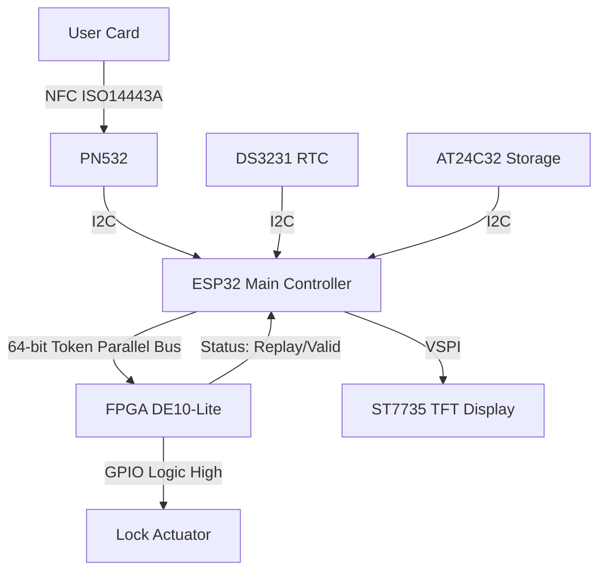

# ESP32 + FPGA Secure RFID/NFC Access Controller  
**Hardware Anti-Replay Protection using Intel MAX 10 (DE10-Lite)**  
*December 2025 – Personal Project*  
Logan Browning – Mississippi State University ECE '27

# SHACS: Secure Heterogeneous FPGA/ESP32 Access Control System
**Date:** December 2025
**Developer:** Logan Browning – Mississippi State University ECE '27

> **A heterogeneous embedded system combining the flexibility of an ESP32 microcontroller with the immutable security logic of an Intel MAX 10 FPGA.**

---

## Project Overview

This project implements a high-security access control system that offloads critical cryptographic validation to a dedicated **FPGA Hardware Security Module (HSM)**.

Unlike standard microcontroller locks, this system separates the "Application Layer" (UI, Logging, NFC) from the "Security Layer" (Validation). The ESP32 handles the user experience, while the FPGA enforces a strict **hardware-level anti-replay protocol**. Even if the microcontroller software is compromised, the lock mechanism physically cannot trigger without a valid handshake from the FPGA fabric.

## Key Features

### Hardware-Enforced Security
* **Heterogeneous Architecture:** Combines ESP32 (C++) and MAX 10 FPGA (Verilog).
* **Anti-Replay Protection:** FPGA core validates 64-bit rolling tokens. If a token is reused (cloned signal), the FPGA rejects it in <20ns.
* **Hardware Watchdog:** Implements the ESP32 Hardware Watchdog Timer (WDT) to automatically recover from system freezes or voltage spikes (5-second timeout).

### Audit Logging & Telemetry
* **Non-Volatile Storage:** Uses an I²C EEPROM (AT24C32) to store access events permanently, surviving total power failure.
* **Real-Time Clock:** DS3231 precision RTC stamps every log entry with an accurate date/time.
* **Live Dashboard:** 1.8" TFT Display shows a live-updating clock, system status, and color-coded security alerts.

---

## 🛠 System Architecture


---

## Hardware Pinout

| Component | ESP32 Pin | Protocol | Notes |
| :--- | :--- | :--- | :--- |
| **NFC (PN532)** | GPIO 21 (SDA), 22 (SCL) | I²C | Shared Bus |
| **RTC / Memory** | GPIO 21 (SDA), 22 (SCL) | I²C | Address `0x68` (RTC), `0x57` (EEPROM) |
| **TFT Display** | GPIO 18 (SCK), 23 (MOSI) | VSPI | CS: `D5`, DC: `D2`, RST: `D15` |
| **FPGA Clock** | GPIO 4 | Parallel | Shifts token to FPGA |
| **FPGA Latch** | GPIO 16 | Parallel | Triggers validation logic |
| **FPGA Data** | GPIO 25, 26, 27, 32, 33... | Parallel | 8-bit bus (D0-D7) |
| **FPGA Inputs** | GPIO 34 (Valid), 35 (Replay) | Digital | Status feedback from FPGA |
| **Servo** | GPIO 17 | PWM | **MUST use protected 5V rail** |

---

## System Logs

**Serial Monitor Output (Real-Time):**
The system logs timestamps to the Serial port when a card is processed.

```text
LOGGED: 2025-12-25T22:15:05
LOGGED: 2025-12-25T22:15:45
```
**TFT Display Feedback:**
* **Idle:** Blue Screen ("SECURE SYSTEM READY") with Live Clock.
* **Processing:** Yellow Screen with Tag ID.
* **Success:** Green Screen ("ACCESS GRANTED").
* **Attack:** Red Screen ("DENIED: REPLAY!").

---

## Bill of Materials (BOM)

* **Microcontroller:** ESP32-WROOM-32 Development Board
* **FPGA:** Terasic DE10-Lite (Intel MAX 10 10M50DAF484C7G)
* **NFC Reader:** PN532 V3 Module (I2C Mode)
* **Display:** 1.8" ST7735 TFT Display (128x160)
* **RTC/Memory:** DS3231 RTC Module (with onboard AT24C32 EEPROM)
* **Power:** MB102 Breadboard Power Supply (5V/3.3V)
* **Protection Circuit:** 1x PTC Fuse (500mA), 1x 1N4003 Diode, 1x 47µF Capacitor

---

## Future Possible Improvements

* Replace Servo with 12V Solenoid for industrial-grade locking.
* Implement MQTT (Wi-Fi) to push access logs to a cloud dashboard.
* Design custom 2-layer PCB (KiCad) to replace breadboard prototype.

---

**License:** MIT License
**Contact:** [linkedin.com/in/logan-browning](https://linkedin.com/in/logan-browning)
